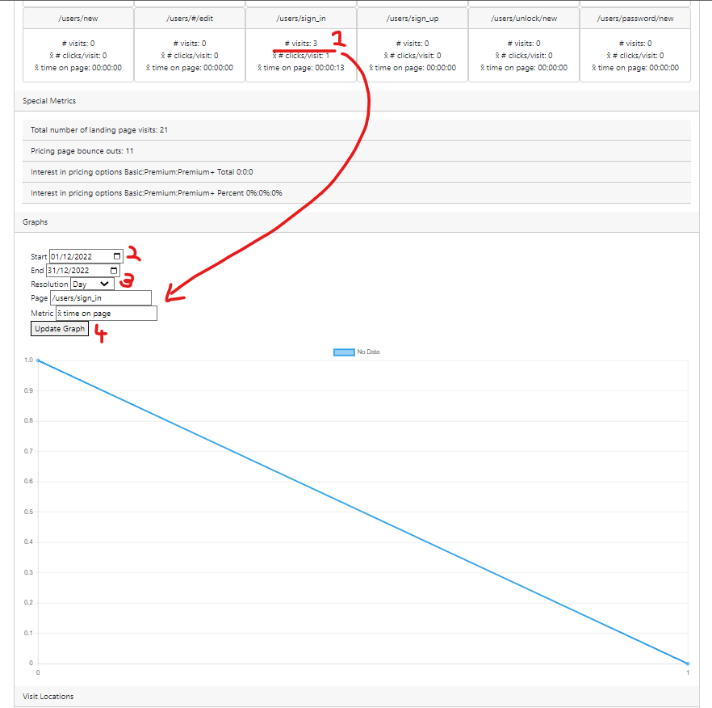

# README

## Ruby Version

The Ruby version used is ruby-3.1.

## System Dependencies

The dependencies required and instructions for their installation are found below:

https://guides.rubyonrails.org/development_dependencies_install.html

## Deployment Instructions

## Database Instructions

We’ve used a postgres database to save user information in this project. To construct and seed the database, run:

$ bundle exec rails db:create

To execute any pending migrations, run:

$ bundle exec rails db:migrate

To reset the database to a clean version from the seed file, run:

$ bundle exec rails db:reset

A full guide to database migrations can be found below.

https://guides.rubyonrails.org/active_record_migrations.html

## Account Details

After following the database instructions,

2 Admin accounts are created with emails:
admin1@planetgo.com
admin2@planetgo.com

2 Reporter accounts are created with emails:

rep1@planetgo.com
rep2@planetgo.com

And 2 basic user accounts are created with emails:

user1@gmail.com
user2@gmail.com

All passwords are:

SneakyPassword100

## Test Instructions

Tests can be locally run with the command:

$ bundle exec rspec

While in the project root folder, which will generate a coverage report and detail any failures.

## App Features

### Metrics page

The metrics page contains a summary of general metrics collected on each page, as well as more detailed metrics that help us verify our business plan. Each metric can be displayed in a graph towards the bottom of the page which, by default, contains a “No Data” dataset with two points forming an identity matrix. To display metrics on a graph over time, select the metric by clicking on it in the list of metrics at the top, pick your start date, end date, and resolution, and click “Update Graph”. The page will refresh and the selected metric will appear on the graph. If no start date and end date is picked, the graph will default to one month ago and today respectively.

The metrics page also contains a map of countries around the world from which the landing page was visited. Each country can be hovered over with the mouse to display the exact number of visits from that country. Keep in mind the start and end date used for the graph does not filter the visits as they appear on the map.

### Reviews

Reviews can be created by any user, and added to the landing page by admins.

Go to the /reviews page to see all reviews uploaded by users.

Go to the /edit page of any review as an admin to correct spelling in the review body, or add the review to the landing page.

Reviews can be reordered on the landing page by visiting the /welcome page as an admin and clicking on the up/down arrows next to each review.

Reviews can also be “liked” by any user to track review engagement, and they can be removed by admins.

### Register interest and Pricing

A user can “register interest” by visiting the /pricings page and selecting any of the pricing options. This takes the user to a sign up page, where they can register their email for contact when the application has reached MVP. After registering interest, the user is prompted to create an account.

Admins can visit /register_interests to see all emails which have been registered, and which plan was selected

### FAQs

On the /faqs page, a user can see all approved frequently asked questions. If an admin visits this page, they can see all submitted questions, and can edit a question to answer it and display it for all users.

## Coding Standards

Ruby:  https://github.com/rubocop/rubocop
Javascript: https://www.w3schools.com/js/js_conventions.asp

